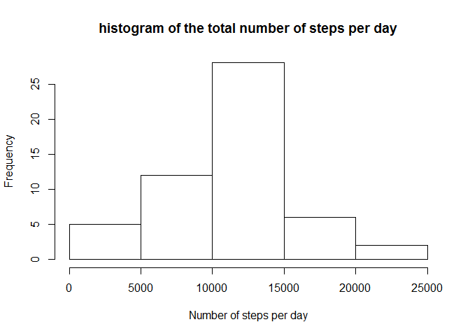
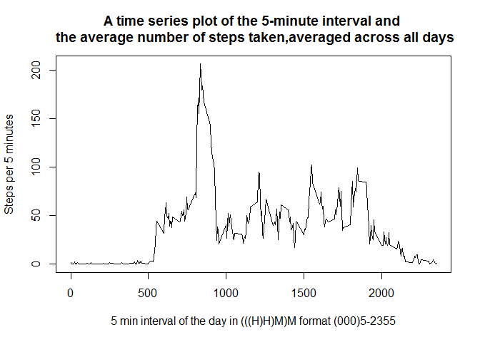
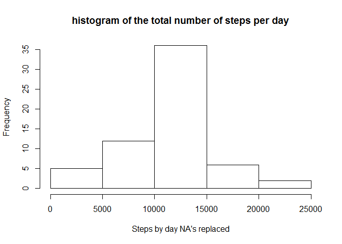

# Reproducible Research: Peer Assessment 1
## Introduction

*This assignment makes use of data from a personal activity monitoring device. This device collects data at 5 minute intervals through out the day. 
The data consists of two months of data from an anonymous individual collected during the months of October and November, 2012 and include the number of steps taken in 5 minute intervals each day.*

## Loading the necessary library's and general info

##### 1. Loading the library's

```r
library(plyr)
library(xtable)
library(ggplot2)
library(lattice)
```

##### 2. R session info about R machine and OS


```r
sessionInfo()
```

R version 3.1.2 (2014-10-31)
Platform: x86_64-w64-mingw32/x64 (64-bit)

locale:
[1] LC_COLLATE=English_United Kingdom.1252 
[2] LC_CTYPE=English_United Kingdom.1252   
[3] LC_MONETARY=English_United Kingdom.1252
[4] LC_NUMERIC=C                           
[5] LC_TIME=English_United Kingdom.1252    

attached base packages:
[1] stats     graphics  grDevices utils     datasets  methods   base     

other attached packages:
[1] lattice_0.20-29 ggplot2_1.0.0   xtable_1.7-4    plyr_1.8.1     

loaded via a namespace (and not attached):
 [1] colorspace_1.2-4 digest_0.6.4     evaluate_0.5.5   formatR_1.0     
 [5] grid_3.1.2       gtable_0.1.2     htmltools_0.2.6  httr_0.5        
 [9] knitr_1.8        MASS_7.3-35      munsell_0.4.2    proto_0.3-10    
[13] Rcpp_0.11.3      RCurl_1.95-4.3   reshape2_1.4.1   rmarkdown_0.3.10
[17] scales_0.2.4     stringr_0.6.2    swirl_2.2.16     testthat_0.9.1  
[21] tools_3.1.2      yaml_2.1.13     

##### 3. Date and time
==>> Date and time of upload:  Tue Feb 10 14:24:28 2015


#### 4. Github address
==>>  https://github.com/boudenoodt/RepData_PeerAssessment1

## Loading and preprocessing the data

##### 1. read the data file "activity.csv "

The variables included in this dataset are:

+ steps: Number of steps taking in a 5-minute interval (missing values are coded as NA)

+ date: The date on which the measurement was taken in YYYY-MM-DD format

+ interval: Identifier for the 5-minute interval in which measurement was taken

+ The dataset is stored in a comma-separated-value (CSV) file and there are a total of 17,568 observations in this dataset.

+ This file can be downloaded from "https://d396qusza40orc.cloudfront.net/repdata%2Fdata%2Factivity.zip""


```r
stepsDB <- read.csv("activity.csv",header=TRUE)
xt <- xtable(head(stepsDB),caption ="Head of data in HTML")
print(xt,type="html",caption.placement = "top") 
```

<!-- html table generated in R 3.1.2 by xtable 1.7-4 package -->
<!-- Tue Feb 10 14:24:29 2015 -->
<table border=1>
<caption align="top"> Head of data in HTML </caption>
<tr> <th>  </th> <th> steps </th> <th> date </th> <th> interval </th>  </tr>
  <tr> <td align="right"> 1 </td> <td align="right">  </td> <td> 2012-10-01 </td> <td align="right">   0 </td> </tr>
  <tr> <td align="right"> 2 </td> <td align="right">  </td> <td> 2012-10-01 </td> <td align="right">   5 </td> </tr>
  <tr> <td align="right"> 3 </td> <td align="right">  </td> <td> 2012-10-01 </td> <td align="right">  10 </td> </tr>
  <tr> <td align="right"> 4 </td> <td align="right">  </td> <td> 2012-10-01 </td> <td align="right">  15 </td> </tr>
  <tr> <td align="right"> 5 </td> <td align="right">  </td> <td> 2012-10-01 </td> <td align="right">  20 </td> </tr>
  <tr> <td align="right"> 6 </td> <td align="right">  </td> <td> 2012-10-01 </td> <td align="right">  25 </td> </tr>
   </table>

##### 2. Ignore the missing values and put this in a new  dataset 


```r
stepsDB_without_na  <- na.omit(stepsDB)
```

## What is mean total number of steps taken per day?


###### 1. Calculate the total number of steps taken per day


```r
stepsDB_sum_by_date <- ddply(stepsDB_without_na, c(as.quoted("date")),summarise,steps=sum((steps)))
xt <- xtable(stepsDB_sum_by_date,caption ="total number of steps per day")
print(xt,type="html",caption.placement = "top")  
```

<!-- html table generated in R 3.1.2 by xtable 1.7-4 package -->
<!-- Tue Feb 10 14:24:29 2015 -->
<table border=1>
<caption align="top"> total number of steps per day </caption>
<tr> <th>  </th> <th> date </th> <th> steps </th>  </tr>
  <tr> <td align="right"> 1 </td> <td> 2012-10-02 </td> <td align="right"> 126 </td> </tr>
  <tr> <td align="right"> 2 </td> <td> 2012-10-03 </td> <td align="right"> 11352 </td> </tr>
  <tr> <td align="right"> 3 </td> <td> 2012-10-04 </td> <td align="right"> 12116 </td> </tr>
  <tr> <td align="right"> 4 </td> <td> 2012-10-05 </td> <td align="right"> 13294 </td> </tr>
  <tr> <td align="right"> 5 </td> <td> 2012-10-06 </td> <td align="right"> 15420 </td> </tr>
  <tr> <td align="right"> 6 </td> <td> 2012-10-07 </td> <td align="right"> 11015 </td> </tr>
  <tr> <td align="right"> 7 </td> <td> 2012-10-09 </td> <td align="right"> 12811 </td> </tr>
  <tr> <td align="right"> 8 </td> <td> 2012-10-10 </td> <td align="right"> 9900 </td> </tr>
  <tr> <td align="right"> 9 </td> <td> 2012-10-11 </td> <td align="right"> 10304 </td> </tr>
  <tr> <td align="right"> 10 </td> <td> 2012-10-12 </td> <td align="right"> 17382 </td> </tr>
  <tr> <td align="right"> 11 </td> <td> 2012-10-13 </td> <td align="right"> 12426 </td> </tr>
  <tr> <td align="right"> 12 </td> <td> 2012-10-14 </td> <td align="right"> 15098 </td> </tr>
  <tr> <td align="right"> 13 </td> <td> 2012-10-15 </td> <td align="right"> 10139 </td> </tr>
  <tr> <td align="right"> 14 </td> <td> 2012-10-16 </td> <td align="right"> 15084 </td> </tr>
  <tr> <td align="right"> 15 </td> <td> 2012-10-17 </td> <td align="right"> 13452 </td> </tr>
  <tr> <td align="right"> 16 </td> <td> 2012-10-18 </td> <td align="right"> 10056 </td> </tr>
  <tr> <td align="right"> 17 </td> <td> 2012-10-19 </td> <td align="right"> 11829 </td> </tr>
  <tr> <td align="right"> 18 </td> <td> 2012-10-20 </td> <td align="right"> 10395 </td> </tr>
  <tr> <td align="right"> 19 </td> <td> 2012-10-21 </td> <td align="right"> 8821 </td> </tr>
  <tr> <td align="right"> 20 </td> <td> 2012-10-22 </td> <td align="right"> 13460 </td> </tr>
  <tr> <td align="right"> 21 </td> <td> 2012-10-23 </td> <td align="right"> 8918 </td> </tr>
  <tr> <td align="right"> 22 </td> <td> 2012-10-24 </td> <td align="right"> 8355 </td> </tr>
  <tr> <td align="right"> 23 </td> <td> 2012-10-25 </td> <td align="right"> 2492 </td> </tr>
  <tr> <td align="right"> 24 </td> <td> 2012-10-26 </td> <td align="right"> 6778 </td> </tr>
  <tr> <td align="right"> 25 </td> <td> 2012-10-27 </td> <td align="right"> 10119 </td> </tr>
  <tr> <td align="right"> 26 </td> <td> 2012-10-28 </td> <td align="right"> 11458 </td> </tr>
  <tr> <td align="right"> 27 </td> <td> 2012-10-29 </td> <td align="right"> 5018 </td> </tr>
  <tr> <td align="right"> 28 </td> <td> 2012-10-30 </td> <td align="right"> 9819 </td> </tr>
  <tr> <td align="right"> 29 </td> <td> 2012-10-31 </td> <td align="right"> 15414 </td> </tr>
  <tr> <td align="right"> 30 </td> <td> 2012-11-02 </td> <td align="right"> 10600 </td> </tr>
  <tr> <td align="right"> 31 </td> <td> 2012-11-03 </td> <td align="right"> 10571 </td> </tr>
  <tr> <td align="right"> 32 </td> <td> 2012-11-05 </td> <td align="right"> 10439 </td> </tr>
  <tr> <td align="right"> 33 </td> <td> 2012-11-06 </td> <td align="right"> 8334 </td> </tr>
  <tr> <td align="right"> 34 </td> <td> 2012-11-07 </td> <td align="right"> 12883 </td> </tr>
  <tr> <td align="right"> 35 </td> <td> 2012-11-08 </td> <td align="right"> 3219 </td> </tr>
  <tr> <td align="right"> 36 </td> <td> 2012-11-11 </td> <td align="right"> 12608 </td> </tr>
  <tr> <td align="right"> 37 </td> <td> 2012-11-12 </td> <td align="right"> 10765 </td> </tr>
  <tr> <td align="right"> 38 </td> <td> 2012-11-13 </td> <td align="right"> 7336 </td> </tr>
  <tr> <td align="right"> 39 </td> <td> 2012-11-15 </td> <td align="right">  41 </td> </tr>
  <tr> <td align="right"> 40 </td> <td> 2012-11-16 </td> <td align="right"> 5441 </td> </tr>
  <tr> <td align="right"> 41 </td> <td> 2012-11-17 </td> <td align="right"> 14339 </td> </tr>
  <tr> <td align="right"> 42 </td> <td> 2012-11-18 </td> <td align="right"> 15110 </td> </tr>
  <tr> <td align="right"> 43 </td> <td> 2012-11-19 </td> <td align="right"> 8841 </td> </tr>
  <tr> <td align="right"> 44 </td> <td> 2012-11-20 </td> <td align="right"> 4472 </td> </tr>
  <tr> <td align="right"> 45 </td> <td> 2012-11-21 </td> <td align="right"> 12787 </td> </tr>
  <tr> <td align="right"> 46 </td> <td> 2012-11-22 </td> <td align="right"> 20427 </td> </tr>
  <tr> <td align="right"> 47 </td> <td> 2012-11-23 </td> <td align="right"> 21194 </td> </tr>
  <tr> <td align="right"> 48 </td> <td> 2012-11-24 </td> <td align="right"> 14478 </td> </tr>
  <tr> <td align="right"> 49 </td> <td> 2012-11-25 </td> <td align="right"> 11834 </td> </tr>
  <tr> <td align="right"> 50 </td> <td> 2012-11-26 </td> <td align="right"> 11162 </td> </tr>
  <tr> <td align="right"> 51 </td> <td> 2012-11-27 </td> <td align="right"> 13646 </td> </tr>
  <tr> <td align="right"> 52 </td> <td> 2012-11-28 </td> <td align="right"> 10183 </td> </tr>
  <tr> <td align="right"> 53 </td> <td> 2012-11-29 </td> <td align="right"> 7047 </td> </tr>
   </table>

###### 2. Create the histogram of the total number of steps taken each day

```r
hist(stepsDB_sum_by_date$steps,xlab="Number of steps per day", ylab="Frequency",main="histogram of the total number of steps per day")
```

 
  
###### 3. Calculate and report the mean and median of the total number of steps taken per day  

```r
print("mean of the total number of steps taken per day    :") ; mean(stepsDB_sum_by_date$steps) 
```

[1] "mean of the total number of steps taken per day    :"
[1] 10766.19

```r
print("median of the total number of steps taken per day  :") ; median(stepsDB_sum_by_date$steps) 
```

[1] "median of the total number of steps taken per day  :"
[1] 10765

## What is the average daily activity pattern?  

###### 1.  A time series plot of the 5-minute interval and the average number of steps taken,averaged across all days  


```r
avg_steps_per_interval_without_na <- ddply(stepsDB_without_na, c(as.quoted("interval")),summarise,steps=mean((steps)))
p <- plot(avg_steps_per_interval_without_na$interval,avg_steps_per_interval_without_na$steps,type = "l",xlab="5 min interval of the day in (((H)H)M)M format (000)5-2355", ylab="Steps per 5 minutes")
title(main="A time series plot of the 5-minute interval and \n the average number of steps taken,averaged across all days") 
```

 

###### 2. Which 5-minute interval, on average across all the days in the dataset, contains the maximum number of steps?  


```r
print("Interval with maximum average steps: ");avg_steps_per_interval_without_na[avg_steps_per_interval_without_na$steps==max(avg_steps_per_interval_without_na$steps),"interval"]
```

[1] "Interval with maximum average steps: "
[1] 835

```r
print("Extra info ===> Number of steps in the Interval with maximum average steps: ");avg_steps_per_interval_without_na[avg_steps_per_interval_without_na$steps==max(avg_steps_per_interval_without_na$steps),"steps"]
```

[1] "Extra info ===> Number of steps in the Interval with maximum average steps: "
[1] 206.1698

## Imputing missing values  

###### 1. Calculate and report the total number of missing values in the dataset (i.e. the total number of rows with NAs)

```r
print("Number of missing values is :  ") ;sum(is.na(stepsDB$steps))
```

[1] "Number of missing values is :  "
[1] 2304

###### 2. Devise a strategy for filling in all of the missing values in the dataset. The strategy does not need to be sophisticated. For example, you could use the mean/median for that day, or the mean for that 5-minute interval, etc.

strategy : ==>> replace the missing values with the mean of that specific interval
using the last produced data.frame (average in avg_steps_per_interval_without_na) with the averaged per interval


###### 3. Create a new dataset that is equal to the original dataset but with the missing data filled in  

* Create a new dataset "stepsDB_completed" by copying/joining the origial "stepsDB" (with the NA's still included) dataset  
and  replacing the NA "steps" values with the corresponding average "steps" values of the same time interval from   the previous calculated "average in avg_steps_per_interval_without_na" dataset 
* Than copy the average interval value from the joined column (also named steps) into the original (steps)column if this contains an NA value,  otherwise do not change the exiting value
* delete the joined "steps" column as no longer needed.


```r
stepsDB_completed<-join(stepsDB,avg_steps_per_interval_without_na,by="interval") # now there are two columns named "steps"
stepsDB_completed[is.na(stepsDB_completed$steps),c(1)]<- stepsDB_completed[is.na(stepsDB_completed$steps),c(4)]
stepsDB_completed<-stepsDB_completed[-4]
```

###### 4. Make a histogram of the total number of steps taken each day and Calculate and report the mean and median total number of steps taken per day. Do these values differ from the estimates from the first part of the assignment? What is the impact of imputing missing data on the estimates of the total daily number of steps?


```r
sum <- ddply(stepsDB_completed, c(as.quoted("date")),summarise,steps=sum((steps)))
hist(sum$steps,xlab="Steps by day NA's replaced", ylab="Frequency",main="histogram of the total number of steps per day")
```

 

```r
print("mean of the total number of steps taken per day    :") ; mean(sum$steps) 
```

[1] "mean of the total number of steps taken per day    :"
[1] 10766.19

```r
print("median of the total number of steps taken per day  :") ; median(sum$steps) 
```

[1] "median of the total number of steps taken per day  :"
[1] 10766.19

The mean value is the has not changed  by replacing the NA's because we replaced it by the mean value , As a result the mean value does not change.

The median value is now the same as the mean value and changed a bit compared
with the values calculated without the NA 's replaced by the corresponding mean value.

## Are there differences in activity patterns between weekdays and weekends?

###### 1. Create a new factor variable in the dataset with two levels - "weekday" and "weekend" indicating whether a given date is a weekday or weekend day. 


```r
## convert date to POSIXlt format so that we can use the component "$wday"" of this format and 
## the sunday or saterday are returned as digit  "0"  or "6"  and the "mod" operator (%%6) 
## returns in both cases a "0". 
## The simpler wday() "function" returns a value from "1"" to "7" and so the 
## expression would be a bitmore elaborated
stepsDB_completed$wd<- as.factor(ifelse(as.POSIXlt(as.Date(stepsDB_completed$date))$wday%%6==0,"weekend","weekday"))
```

###### 2. Make a panel plot containing a time series plot (i.e. type = "l") of the 5-minute interval (x-axis) and the average number of steps taken, averaged across all weekday days or weekend days (y-axis). See the README file in the GitHub repository to see an example of what this plot should look like using simulated data.  


```r
# we will use the lattice library
average_steps_per_interval_wd <- ddply(stepsDB_completed, c("wd","interval"),summarise,steps=mean((steps)))
p <- xyplot(steps ~ interval | factor(wd), data = average_steps_per_interval_wd,  layout=c(1,2), type = "l")
print(p)
```

 

